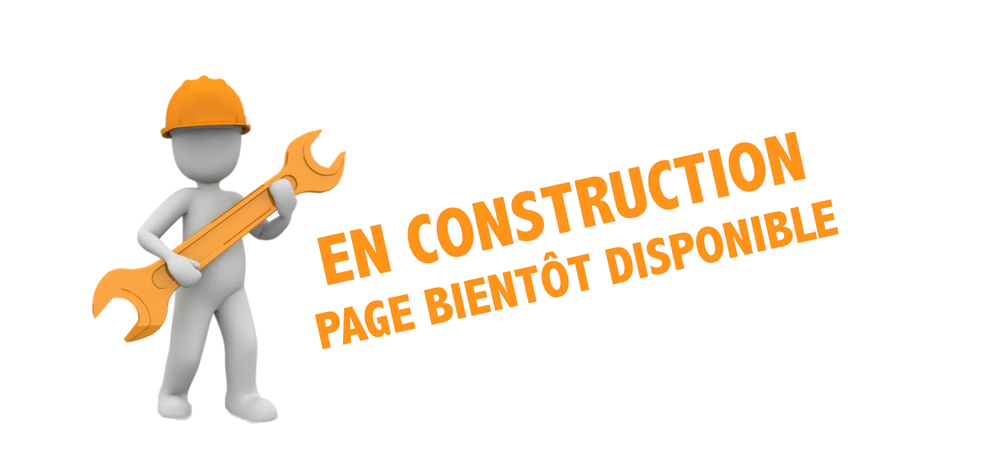

# Script d'utilisation de la caméra Raspberry PI 5

# Actuellement en DEV




## Intro

La librairie python3-picamera2 est une bibliothèque Python développée par Raspberry Pi pour interagir avec les caméras compatibles (comme les modules Raspberry Pi Camera) en utilisant libcamera. Elle est conçue pour remplacer l’ancienne picamera et offre une interface plus moderne et flexible.

Objectif de l'utilitaire "camera.py" :

* Test simple de la camera du Raspberry
* Test d'inférence YOLO
* Test d'inférence ONNX
* Test d'inférence HAILO


## Installation

```bash
sudo apt install python3-picamera2
```


```bash
git clone https://github.com/FredJ21/RPI_Camera_tests.git

cd RPI_Camera_tests.git

virtualenv --system-site-packages venv
source venv/bin/activate
pip install -r requirements.txt

```

## Utilisation 
```bash
cd RPI_Camera_tests.git

source venv/bin/activate

python camera.py

```

## Options

TODO 


## *References & Official documentations*


### Raspberry Pi Camera Module 3

https://www.raspberrypi.com/products/camera-module-3

### Camera software

https://www.raspberrypi.com/documentation/computers/camera_software.html

### Github repo of picamera2 python library

https://github.com/raspberrypi/picamera2

### Picamera2 Python library - PDF manual

https://datasheets.raspberrypi.com/camera/picamera2-manual.pdf

### Module AI

https://www.raspberrypi.com/documentation/computers/ai.html


